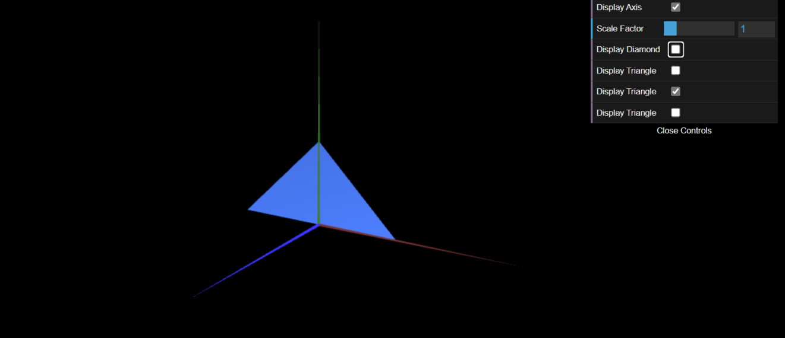

# CG 2023/2024

## Group T0xG0y

## TP 1 Notes

(add your main observations/remarks about your experiments here, in a bulleted list, and remove this line. Some examples below)

- No início da ficha , foi incluida uma classe MyDiamond que descrevia a representação tridimensional de um losango cujo centro geométrico coincidia com a origem do referencial:

- Após a conclusão do exercício 1, foi nos pedido, no exercício 2, não só a representação de um triângulo retângulo no referencial, como também o resultado do seu escalonamento em relação à origem em 1 unidade.

