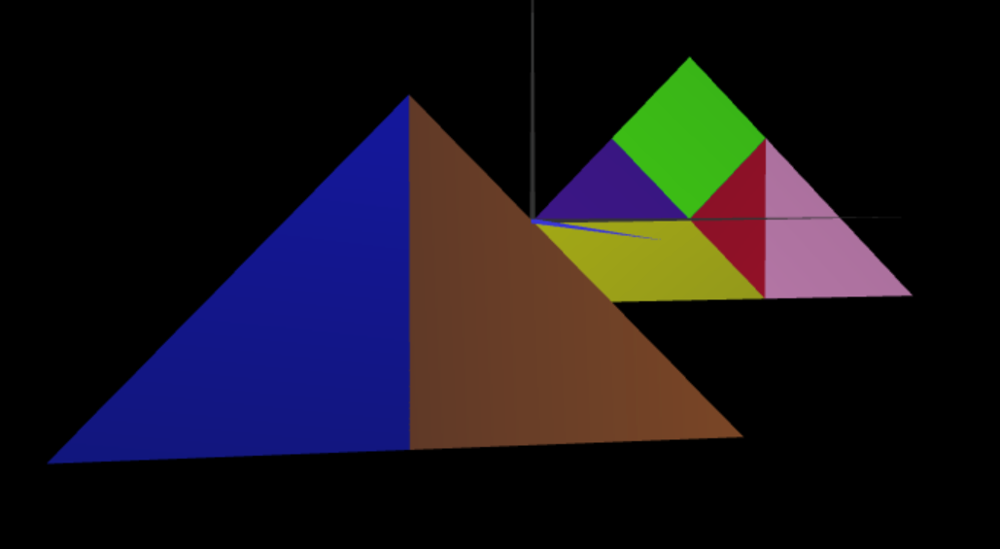
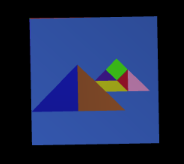
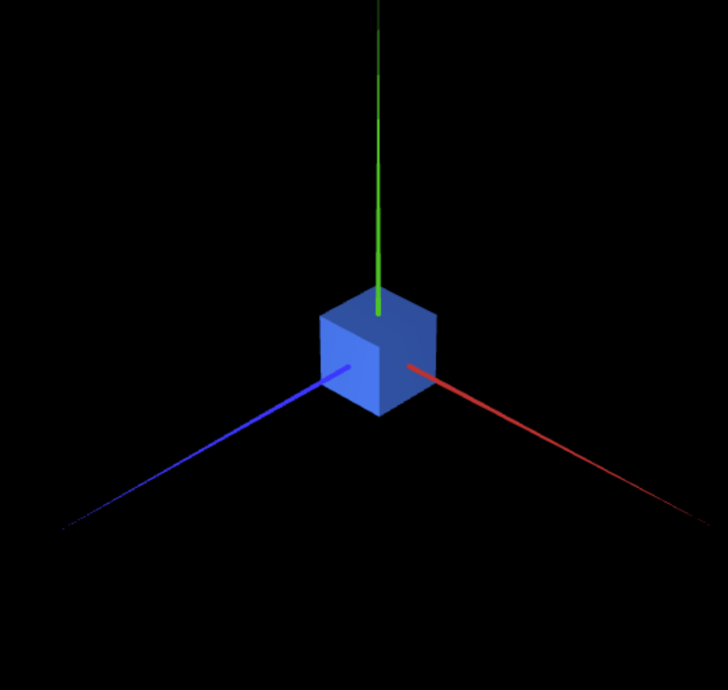

# [COPY FROM PREVIOUS TP AND ADJUST]
No exercício 1, desenvolvemos uma classe denominada MyTangram com base nas figuras que foram criadas na aula prática anterior. Uma vez que o tangrama consiste numa construção geométrica composta por figuras criadas na TP1, para formar o tangrama pretendido,  criámos as figuras necessárias , organizando-as através de  transformações geométricas ( nomeadamente translações, rotações e escalonamentos) , dispondo-as de uma forma relativa a fim de chegar ao resultado desejado. Implementámos também uma caixa de seleção que possibilita controlar a visibilidade do tangrama.

Inicialmente comecou-se por criar uma classe que viria a inicializar os buffers necessários para a representação de um cubo. Assim, definiram-se os seus 8 vertices, considerando-se o seu centro geométrico como a origem do referencial, e lado 1. Foi necessário ter em conta os tripletos de vértices que definiram a iluminação de cada uma das suas faces, para poderem ser simultaneamente visíveis todos os planos.
De seguida , usando a classe que define um tangrama criada no exercício anterior, acabamos por instanciar esta classe, ao mesmo tempo que instanciamos o cubo, ao fim de criar as matrizes de transformação necessárias para dispor o cubo nas costas do tangrama. Uma vez que este se teria de encontrar paralelo ao eixo x0z, foi necessária uma rotação em relação ao eixo x, sendo que este se encontrava paralelo ao eixo x0y. 
É importante referir que , o exercício seguinte ( exercício 3), foi feito antes deste exercício, pelo que se usou a representção do cubo feita no exercício 3 , uma vez que se concluiu ser mais prático aplicar uma transformação geométrica em relação ao centro geométrico do cubo, ao invés de aplicar transformações geométricas singulares a cada um dos seus vértices. Assim, também foi possível fazer um escalonamento em relação ao seu centro geométrico, a fim de garantir a proporcionalidade da figura , e a coincidência da sua face superior com o plano xOz. 
Por fim, através de translações, dispôs-se o tangrama de forma a que o seu centro (escolhido arbitrariamente por ser uma figura irregular) coincidisse com o centro da face superior do cubo, e aplicou-se nessa translação uma pequena distância ao plano da face do cubo para evitar artefactos visuais (isto é, fenómenos de flickering).

Por fim, repetindo-se a construção de um cubo feita anteriormente, pelo que desta vez se construiu um cubo com base nas transformações geométricas de uma face quadrada.
Assim, cada face do cubo corresponde a uma translação de um plano quadrado cujo centro corresponde à origem do referencial, seguida de uma rotação , nas faces que são necessárias, isto é, nas faces que não são paralelas ao plano inicial. Desta forma, as faces superior e inferior correspondem a uma rotação de 90 em relação ao eixo X. enquanto que as faces laterais correspondem a uma rotação de 90 em relação ao eixo Y. 
