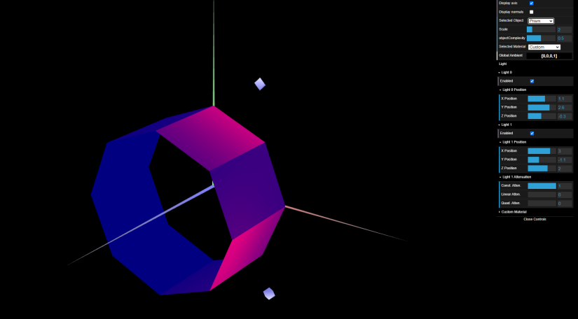

Para o exercício 1, utilizamos as figuras criadas na aula passada, nomeadamente, o cubo e o tangrama. No caso do cubo, definimos as normais para que a luminosidade fosse coerente com o ângulo em que a luz incide sobre o objeto e o ângulo a partir do qual o objeto é observado. Também criamos um novo material semelhante à madeira com baixa componente especular.

Para o tangrama, definimos também as normais para cada figura que constituí o tangrama assim como materiais com alta componente especular semelhante ás cores que constituem a figura.

No exercício 2 , foi nos sugerido que representassemos um prisma octogonal dividido em 20 partes. A maior dificuldade apresentada foi descrever a distribuição dos vértices
e definir com estes malhas triangulares a fim de criar as suas faces laterais, de forma iterativa, ao mesmo tempo que a estes corresponderiam as suas normais calculadas, que eram calculadas com base no ângulo. A iluminação calculada foi semelhante à calculada com Constant Shading uma vez que as normais para uma mesma face são iguais.

No exercício 3, à semelhança do prisma , foi nos sugerido que representassemos um cilindro. Uma vez que os vértices não se podiam repetir , tornou-se mais difícil descrever a malha triangular que definisse as faces laterais , uma vez que os índices seriam definidos após os vértices serem criados , o que requiriu uma maior imaginação da sua disposição geométrica. Por outro lado, em relação ao prisma , havia menos vértices e normais a serem calculadas. pois estas eram perpendiculares a cada vértice. Para a mesma iluminação utilizada na representação da figura do exercício anterior, notou-se que as arestas da atual figura criada são menos evidentes que as arestas da figura anterior, uma vez que foram suavizadas. Assim, à semelhança de um cilindro, cria-se uma aparência curva.

