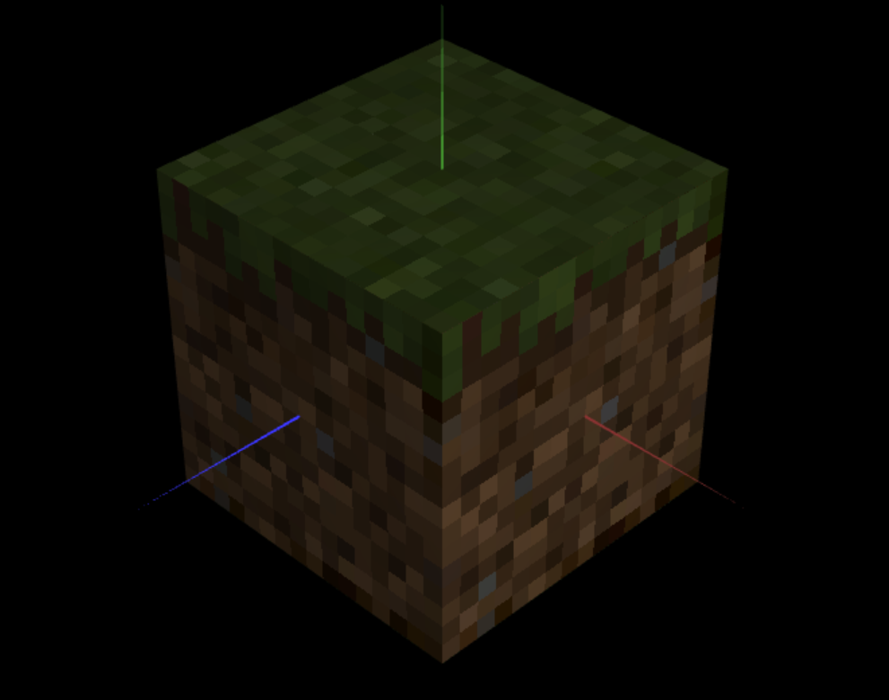

# CG 2023/2024

## Group T06G05

## TP 4 Notes

No segundo exercício, aplicamos texturas a todos os quads (faces) utilizados na classe MyUnitCubeQuad, desenvolvida na TP2. Como a resolução da imagem de textura é significativamente menor do que a área que cada quadrado deve cobrir, e o método padrão emprega uma interpolação linear das cores, a representação inicial resultou em uma figura com aspecto desfocado. Ao modificarmos o método de filtragem utilizado, isto é, ao utilizar o comando que permite alterar o tipo de filtragem, comentado originalmente na função display() de MyScene, para cada face do cubo, conseguimos obter uma imagem com maior nitidez.

