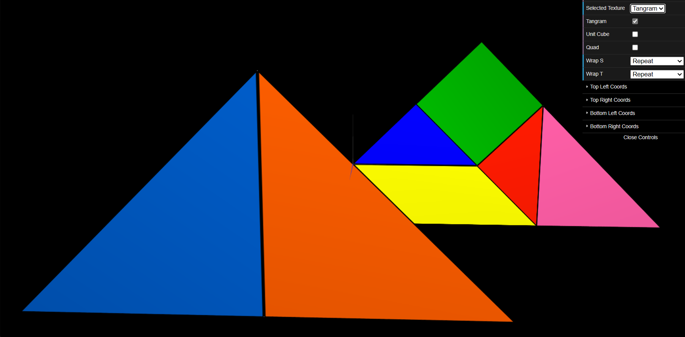

# CG 2023/2024

## Group T06G05

## TP 4 Notes

No primeiro exercício, aplicamos texturas ao Tangrama, a fim de construir uma figura cujos elementos correspondessem a um mapeamento da imagem tangram.png fornecida. Assim, o objetivo era que cada elemento no tangrama tivesse a mesma cor que a sua figura correspondente na imagem. Contudo , uma vez que o tangrama é construído através de transformações dos seus objetos, não conseguimos efetivamente distinguir o mapeamento da textura dos triângulos maiores (objetos da classe MyTriangleBig). Assim, ficamos com esta dúvida , uma vez que, na tentativa de resolver este problema, experimentámos usar um método (um setter) que mudasse as suas coordenadas de textura ( que por sua vez é um atributo privado do objeto ), o que não foi bem sucedido. Assim, espera-se que apenas as transformações geométricas mudem as coordenadas do objeto, de tal forma que possam também coincidir com as coordenadas da textura pretendida.

No segundo exercício, aplicamos texturas a todos os quads (faces) utilizados na classe MyUnitCubeQuad, desenvolvida na TP2. Como a resolução da imagem de textura é significativamente menor do que a área que cada quadrado deve cobrir, e o método padrão emprega uma interpolação linear das cores, a representação inicial resultou em uma figura com aspecto desfocado. Ao modificarmos o método de filtragem utilizado, isto é, ao utilizar o comando que permite alterar o tipo de filtragem, comentado originalmente na função display() de MyScene, para cada face do cubo, conseguimos obter uma imagem com maior nitidez.

