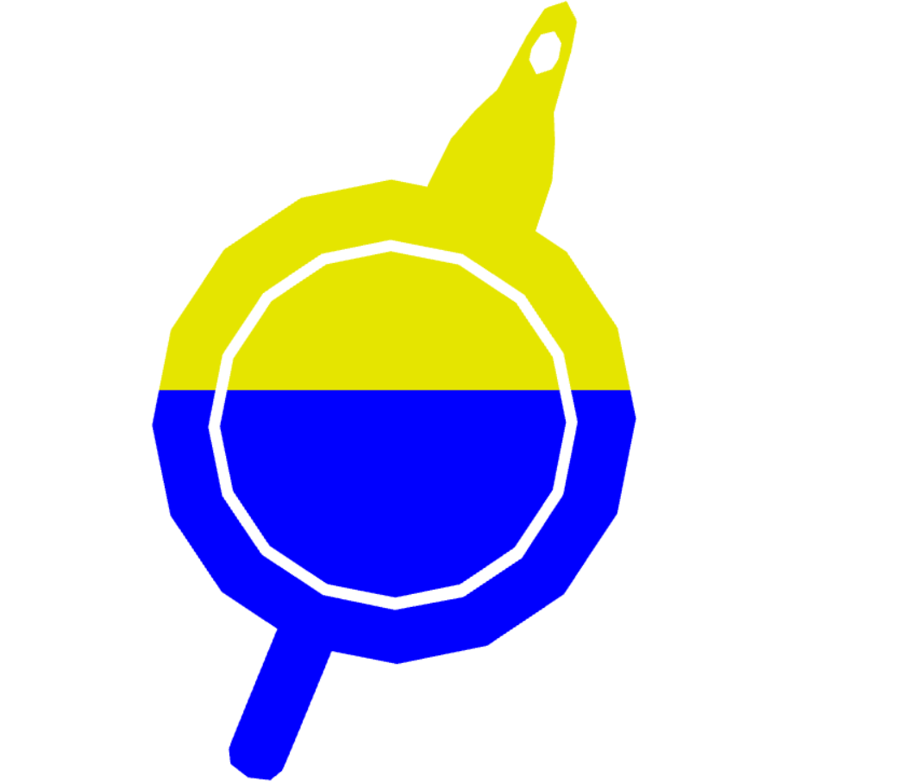
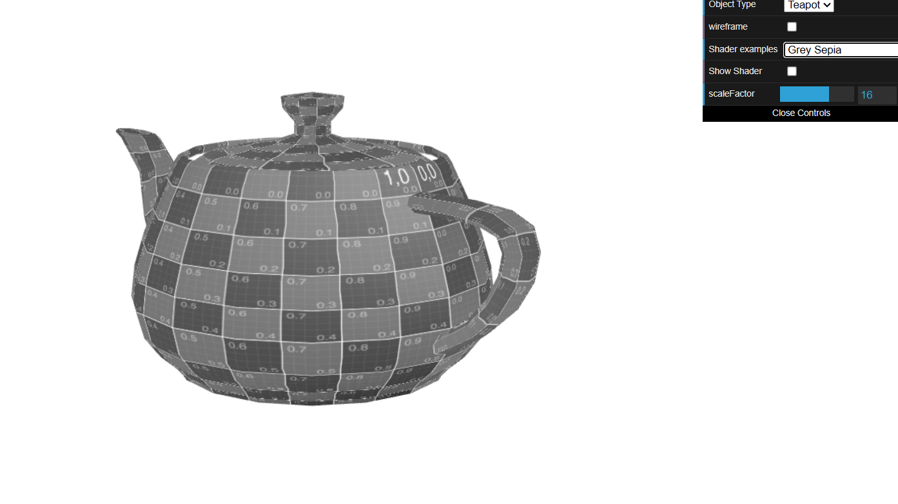
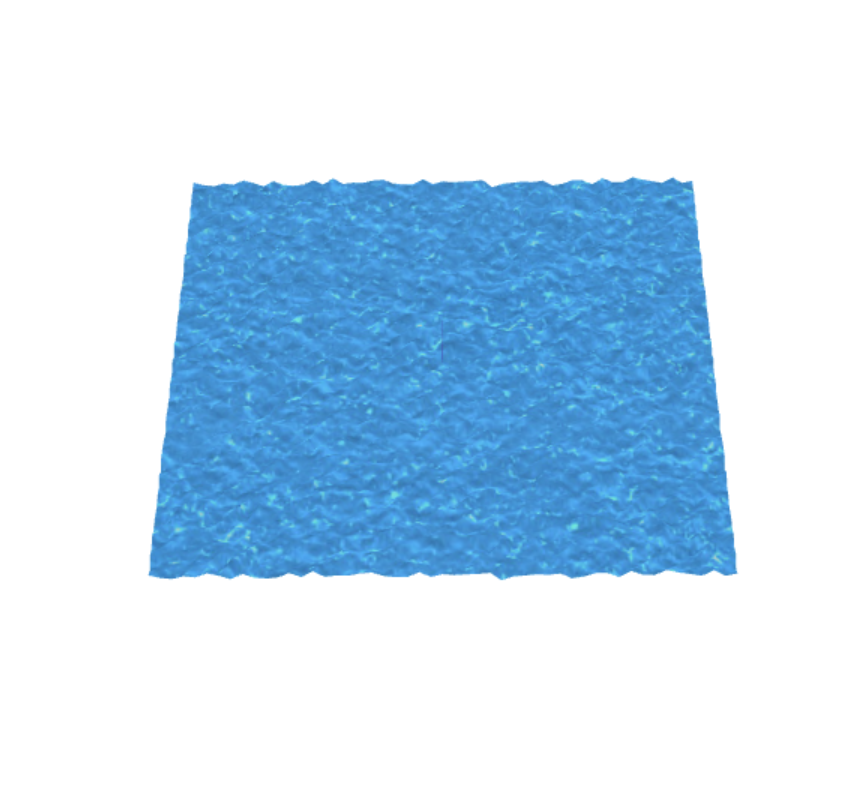

# CG 2023/2024

## Group T06G05

## TP 5 Notes
No primeiro exercício, foi nos sugerido que coloríssmos um modelo 3D de um bule (teapot), sendo que as cores que este teria eram decididas pela posição dos seus fragmentos na janela.
Assim, criando uma nova variável que representasse a posição do vértice a ser mapeado para o shader de fragmento, foi possível definir a sua cor como amarela no caso da posição do vértice estar acima do hemisfério superior do bule, e azul quando este vértice se situasse na metade inferior do bule:

De seguida, criámos uma animação para o shader que projetasse um efeito "back-and-forth", de acordo com uma onda sinosoidal.

Por fim, foi criado um novo shader de fragmento baseado no Sépia, que convertia as cores do bule para corresponderem à sua componente cinzenta respetiva , a qual era obtida segundo a fórmula L = 0.299R + 0.587G + 0.114B.

No segundo exercício, foi nos sugerido que criássemos um novo shader , que , com base nos shaders de vértice e fragmento da texture2 , viriam a dar origem a uma textura com um efeito aquático. Para tal,
foram substituidas as texturas dentro da cena pelas imagens  waterTex.jpg e waterMap.jpg. 

Inicialmente , com os shades acabados de criar, era visivel uma textura aquática com manchas vermelhas-escuras . Posteriormente , foi alterado o vertex shader e para usar a imagem waterMap.jpg como um mapa de altura da textura da água , para que cada vértice pudesse ser deslocado de acordo com o valor de um dos componentes de cor da textura, criando assim a sensação de relevo pretendida

